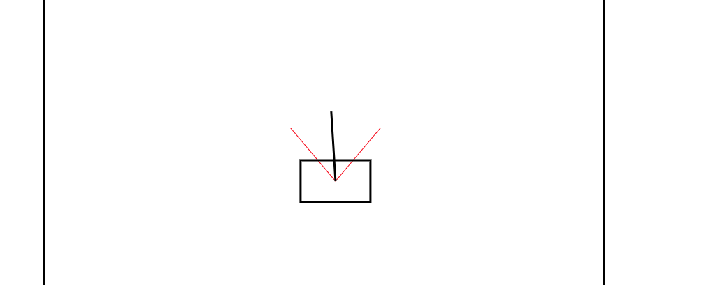

# Balance The Stick

- Small game written in JavaScript to explain how machine learning works.
- The objective is to balance the stick in the cart while keeping the cart inside of the lines.
- The inputs of the system are the position of the cart, the angle of stick and the distance to the walls.

